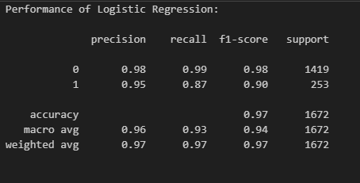
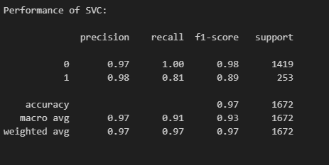
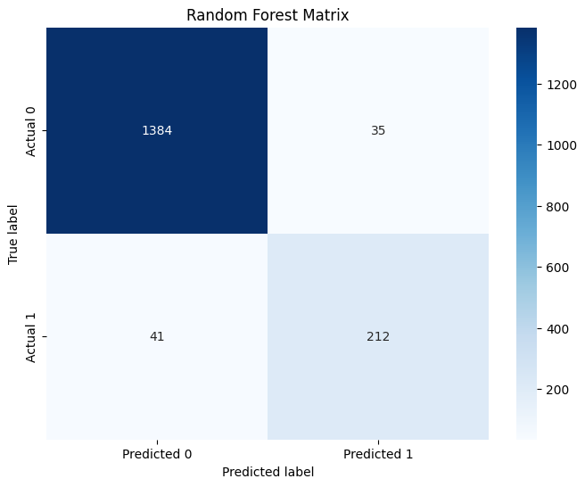
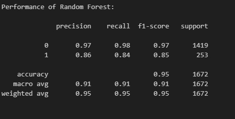
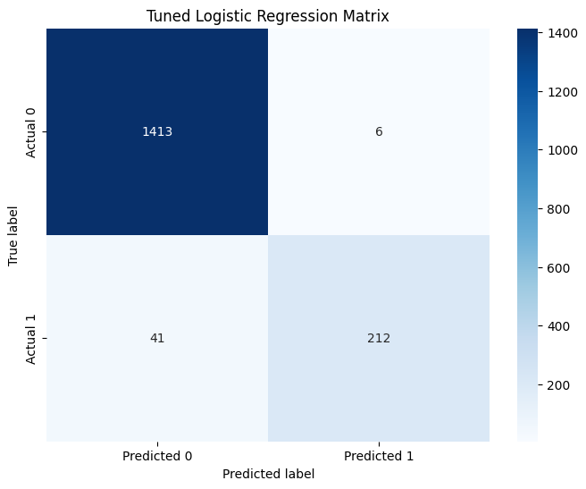
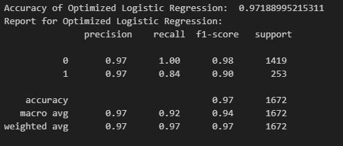
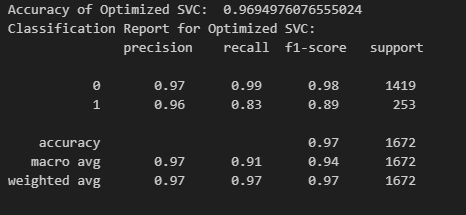
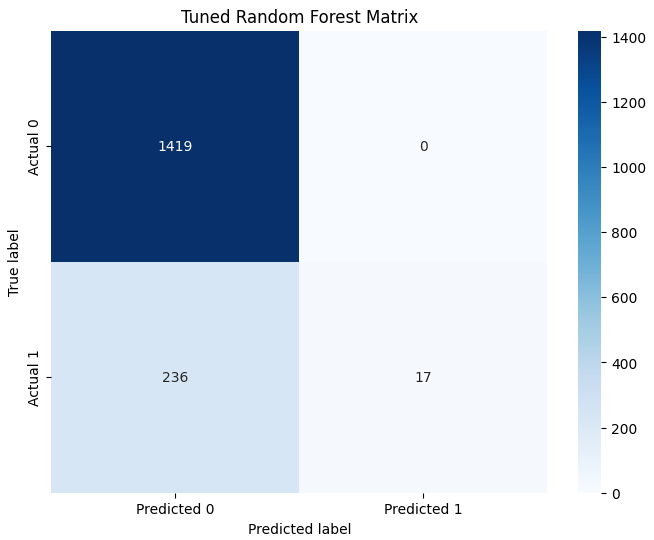
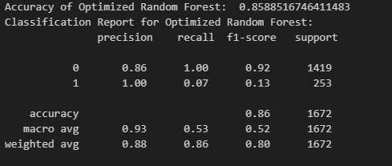

# SafeComm-Digital-Security-Solutions:

Welcome to SafeComm Digital Security Solutions! In the modern digital age, people across the globe
communicate largely through text messages. SMSs have become an integral part of our daily lives.
However, with this ease of communication, there comes a dark side: SMS-based fraud. Unsuspecting
individuals often receive malicious or scam texts intending to deceive or cause harm.
SafeComm has recently partnered with a major telecom provider that has shared anonymized SMS
data. This dataset comprises a mix of regular day-to-day messages and some potentially fraudulent
ones. The objective is to design a mechanism that identifies and flags these fraudulent messages
automatically. This way, we can warn users or even prevent these messages from being delivered
altogether.

## Team Members:
- Eliya Allam [289791]
- Giulio Presaghi [287611]
- Marco Tagliavini [283361]

## Introduction:
### *Background:*

In the era of digital communication, Short Message Service (SMS) plays a pivotal role in connecting people globally. Unfortunately, this convenience comes with a potential downside - SMS-based fraud. Unscrupulous actors often exploit SMS to send deceptive or harmful messages to unsuspecting individuals. SafeComm Digital Security Solutions has teamed up with a major telecom provider to combat this issue. Leveraging a dataset of anonymized SMS data, our objective is to design a robust mechanism capable of automatically identifying and flagging fraudulent messages. This proactive approach aims to warn users and, when necessary, prevent the delivery of such malicious messages.

### *Dataset Overview:*

The dataset provided for this project includes a mix of regular day-to-day messages and potentially fraudulent ones. Each SMS is labeled with a binary indicator (1 for fraudulent, 0 for non-fraudulent). Key features include the SMS text content, a unique identifier (ID) for each message, and a timestamp indicating when the SMS was sent. Since the dataset is way too unbalanced, we opted for a resampling method (RandomOverSampler, because of its simple implementation). 

## Methods:
### Experimental design
- Imputation of Missing Values:
Before diving into the machine learning models, we conducted a thorough examination of the dataset to identify and handle missing values. Any missing values in features must be imputed using appropriate techniques to maintain the integrity of the dataset. Without finding any missing values, the analysis could proceed.

- Categorical Feature Encoding:
Luckily in our case the dataset was already presented with Fraudulent and Non-Fraudulent binary values of 0 and 1. This indeed ensured that we did not have to proceed with one-hot encoding, but instead encoding directly the sms text using Bag of Words method (after sentiment analysis).

### Exploratory Data Analysis (EDA)
- Visualization:
To better understand the distribution and characteristics of the dataset, we performed Exploratory Data Analysis (EDA). Visualizations, including histograms, and time series plots, were generated to provide insights into the prevalence of non-fraudulent over fraudulent messages, patterns in message lengths, and temporal trends.

- Problem Definition:
Given the binary nature of the 'Fraudulent' indicator, this project is framed as a binary classification problem. The objective is to predict whether an SMS is fraudulent or not.

### Model Selection and Design
- Algorithm Selection:
The choice for the algorithms was taken by following some fundamental characteristics for this kind of analysis. Recall, precision were the most important (since in our problem is better to have false positives than false negatives). Given that, we decided to adopt those models both for semplicity and efficiency in use: Logistic regression, Support Vector Machine and Random forests were the models chosen. The baseline for this experiment is meant to be the Logistic Regression model since is one of the simplest linear classification model. In this way, we could try and experiment easily how various preprocessing methods affect the yield of the model.

- Training Overview:
The dataset was split into training and test sets to assess model performance. The training process involved fitting the train set into the chosen algorithm with default parameters and then tuning them trying to improve the yield.

- Hyperparameters tuning
Using grid searches algorithms, it was our goal to find better parameters to apply to the models, in order to achieve even better results. Comparison at the end (both between models and between the standard-hyperparameters results and the tuned-hyperparameters) helped to understand the importance of tuning and to decide the best model (although in some cases the tuning seems not so relevant).

### Environment and Reproducibility
- Environment:
To ensure scalability we provided in the repository a virtual environment with a requirements.txt file in which are signed all the dependencies we used.

### Performance Evaluation
- Evaluation Metric(s):
To evaluate the effectiveness of each algorithm, we employed the following metrics:

    1. Accuracy: This metric provides an overall measure of the model's correctness in predicting both fraudulent and non-fraudulent SMS messages.

    2. Precision and Recall: Precision measures the accuracy of positive predictions, while recall assesses the model's ability to capture all positive instances. Balancing precision and recall is crucial in fraud detection scenarios. In our particular case giving more weight to the recall is important since we want to ensure that no fraudulent message is misdetected, also sacrifying some non-fraudulent one (false positives).

    3. F1 Score: The F1 score combines precision and recall, offering a balanced assessment of model performance, particularly when dealing with imbalanced datasets.

## Results:
### Main Finding(s)
- Model Performance Comparison
After proceeding with each one of our classification models, comparing the performance of Logistic Regression, SVM and Random Forest, we found that SVM and Logistic Regression emerged as the top-performing models. The evaluation metrics, including accuracy, precision, recall, and F1 score, were considered to assess each model's effectiveness in identifying fraudulent SMS messages.

- Hyperparameter Tuning Results 
In regards to our tuned classification models, we observed a significant improvement in overall performance except for Random Forest. The tuned SVM and Logistic Regression models exhibited enhanced accuracy, precision, recall, and F1 score compared to the baseline configurations.

## Conclusion
In conclusion, our project focused on addressing SMS fraud using machine learning models, specifically Logistic Regression, SVM, and Random Forest. Through comprehensive experiments and analysis, we identified Logistic Regression as the most effective model, achieving superior results in accuracy, precision, recall, and F1 score (By the way, also SVM achieved very good and efficient results). The hyperparameter tuning of Logistic Regression slightly optimized its performance. Additionally, considering temporal patterns contributed to a more nuanced understanding, enhancing the model's capabilities during specific time intervals.

# Default models

- As seen in these matrices, logistic regression and Random forests are the ones gaining the best results, with the SVC having a slightly worse outcome.

# Tuned models

- With the hypertuned results, the best outcome is given by the SVC, with logistic regression getting a better result than with the standard-tuned hyperparameters. The tuned version of the random forest is getting a worse outcome than with the standard parameter.

However, there are aspects that our project did not fully address. Further exploration could delve into the interpretability of the models, providing insights into the features contributing most to fraud detection. Additionally, a deeper investigation into evolving fraud patterns and the adaptability of the model over time could enhance the long-term effectiveness of our solution. Lastly, ethical considerations surrounding the deployment of fraud detection mechanisms, including potential biases and privacy concerns, warrant careful examination in future iterations of this work. These unanswered questions pave the way for continued research and refinement in the dynamic landscape of digital security solutions.

In essence, the outcomes of our project not only advance the understanding of SMS-based fraud detection but also offer valuable insights with broader implications for digital security. The success of the Logistic Regression model, coupled with hyperparameter tuning, signifies a significant stride towards more robust and adaptive fraud detection systems. As digital communication continues to be an integral part of our lives, the methodologies and findings presented here lay a foundation for enhancing security measures not only in SMS-based interactions but also in other realms of digital communication. The optimized Logistic Regression model, with its heightened accuracy and precision, showcases the potential for real-world applications, ranging from securing personal communications to fortifying digital platforms against evolving fraudulent tactics. This project thus stands as a stepping stone towards bolstering digital security practices in our interconnected world.

## APPENDIX: IMPROVEMENTS
We decided to add this appendix to suggest some improvements to do: maybe we could try to increase the performance of tuned Random Forest by searching for better parameters(this involves a meticoulous search and experiment for different params). In addition we could try to minimize false negatives (that at the end resulted to be quite high in contrast to false positives) trying to scale the dataset or to add other features (like the ones we analyzed just by scratching the surface).Apart from this, we could also treat the problem as a one-class classification problem, since the dimension of the Fraudulent class is way too small than the one of the Non-Fraudulent. Another improvement could be the one, during the preprocessing phase, of scaling all the words in lowercase, so that the model could concentrate on more important features and reduce the overall complexity.
